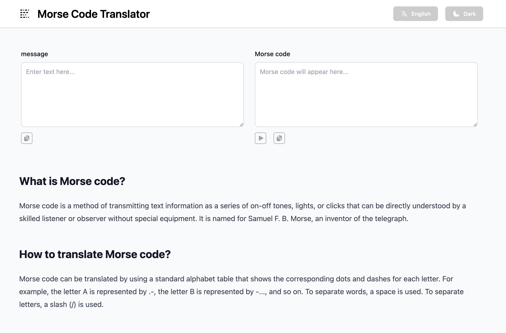

# Morse Code Translator


Morse code encoder and decoder with no dependencies. It supports English, German, French, Spanish, Portuguese, Italian, Polish, with audio-generation functionality using the [Web Audio API](https://developer.mozilla.org/en-US/docs/Web/API/Web_Audio_API).


## Usage
### Browser
Morse decoder exports a global object named 'morse-decoder';
```js
const morse = window['morse-decoder']
const morseAudio = document.querySelector('audio');
const morseDecodeAudio = morse.audio('hello');
morseDecodeAudio.getWaveUrl().then((url) => {
    morseAudio.src = url
    morseAudio.play()
});
```




## License

The MIT License (MIT). Please see [License File](LICENSE) for more information.

  [npm-version]: https://img.shields.io/npm/v/morse-decoder.svg?style=flat-square
  [npm-downloads]: https://img.shields.io/npm/dm/morse-decoder.svg?style=flat-square

  [npm]: https://www.npmjs.com/package/morse-decoder
